# AWS-EBS

## Summary 

### **Attaching an EBS Volume to an Existing EC2 Instance**  

This project demonstrates how to create an **Elastic Block Store (EBS)** volume and attach it to an existing **EC2 instance** for additional storage. The volume is formatted and mounted for immediate use.  

#### **Steps:**  
✅ **Create an EBS Volume** – Specify the size, type, and availability zone matching the EC2 instance.  
✅ **Attach the Volume** – Link the EBS volume to the target EC2 instance.  
✅ **Format the Volume** – If new, format it to a compatible file system (e.g., ext4 for Linux).  
✅ **Mount the Volume** – Attach it to a directory for storage access.  

#### **Example Commands (Linux):**  
1️⃣ **List available disks**  
```bash
lsblk
```

Important Points:

⚠️ EBS is region-specific – The EBS volume must be in the same AWS region as the target EC2 instance.

⚠️ EBS is AZ-specific – The volume must also be in the same Availability Zone (AZ) as the EC2 instance.

⚠️ Data Persistence – EBS retains data even if detached, but deleting the volume is permanent unless backed up.

This setup extends EC2 storage without data loss or downtime. 🚀  

# Step - 1

i. Lets create a EC2 Instance first, Provide the name and keep everything default

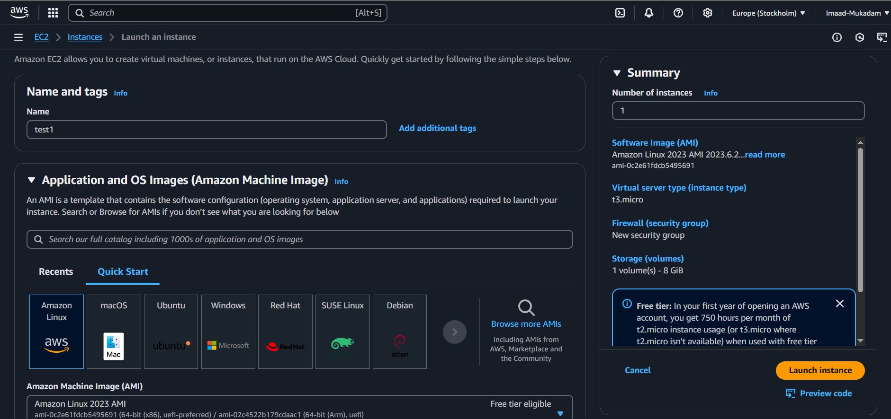

ii. In Configure Storage click on Advanced option 

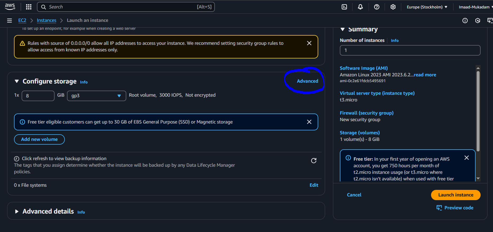

iii. Make sure you selected no , in Delete on termination , this will not delete your data when your instance is terminated

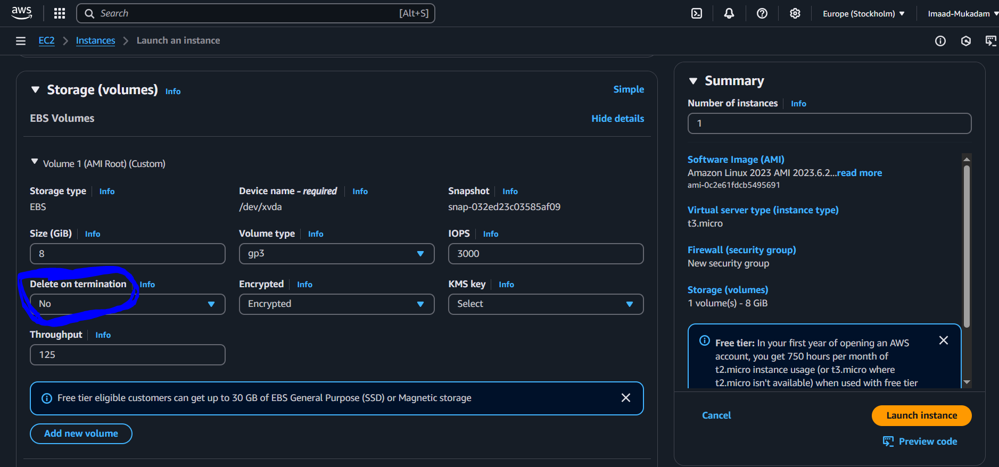

iv. Launch the instance , Now Click on Volumes 

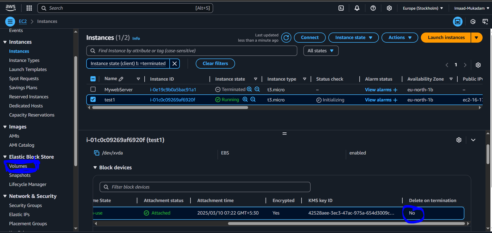

v. You can see your 8GB Volume is created with your instance

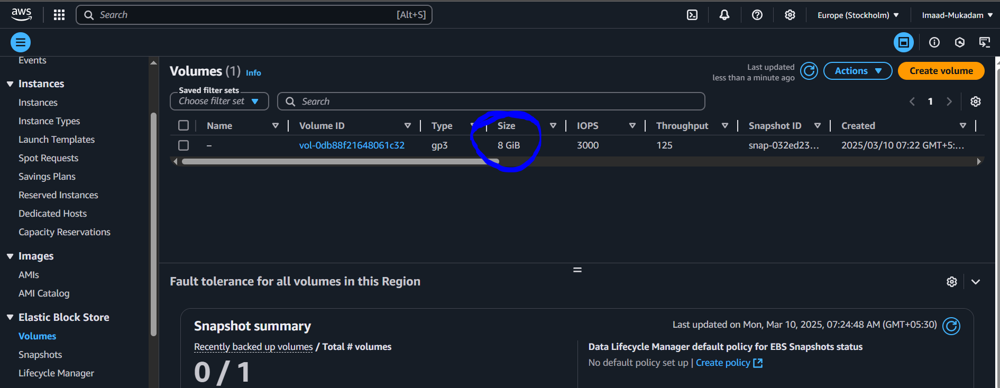

vi. To confirm , Connect your Instance and write this command lsblk , this will show all the partitions in your instance

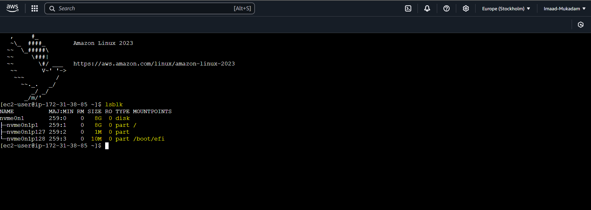

## Step - 2

i. Lets crreate a new volume now

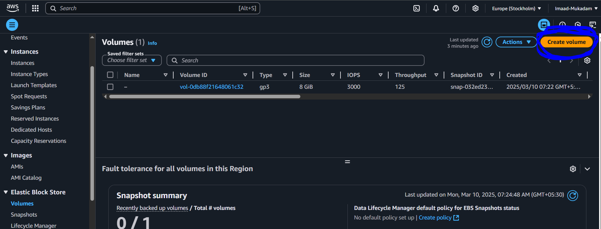

ii. I'm creating a 5GB size of volume , Make sure you select the same avaibility zone as your instance, then click on create volume

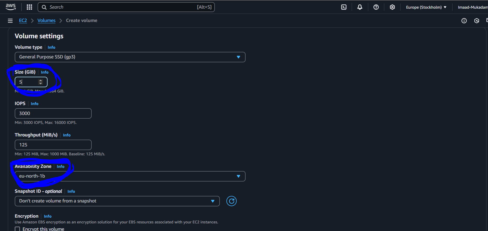

iii. You can see now we have 2 volumes

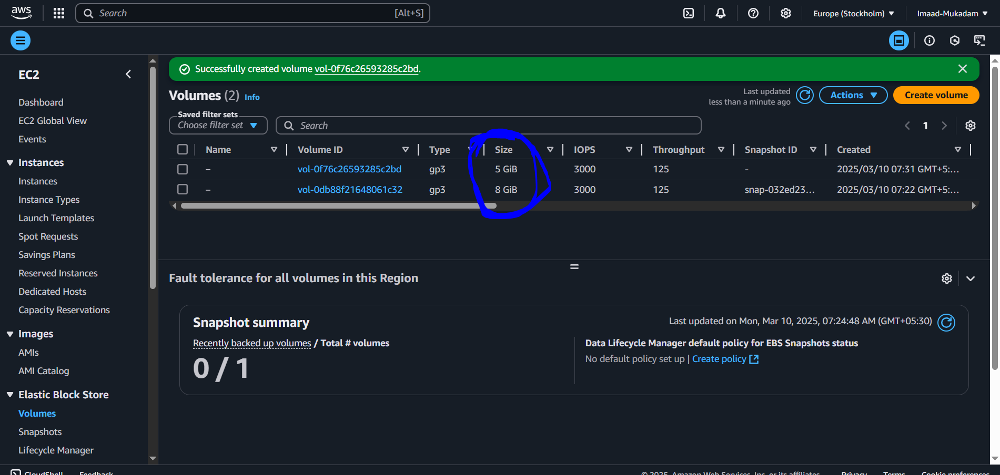

iv. Now select your volume , click on Actions , then click on Attach volumes

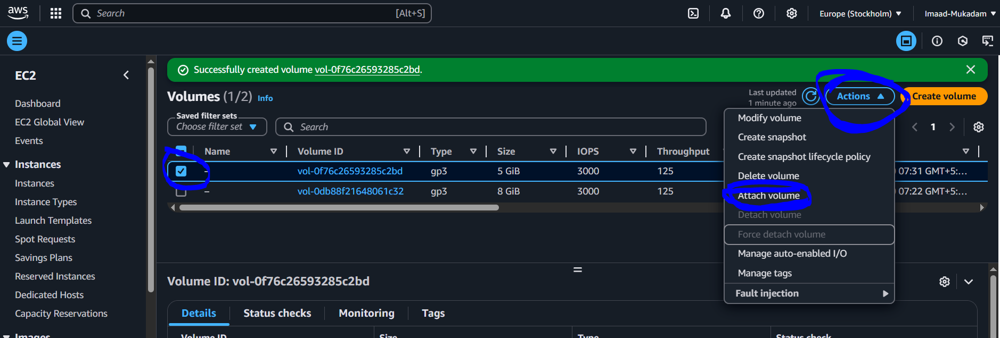

v. Select your instance where you want to attach this instance and give a device name

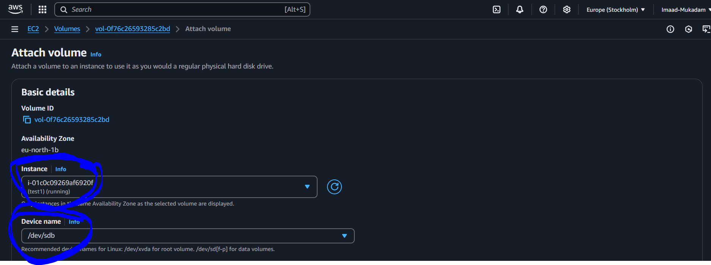

vi. In instance section you can see both the volumes are attached

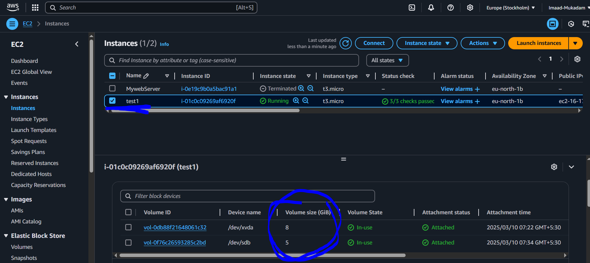

vii. To confirm write the lsblk cammand to check 

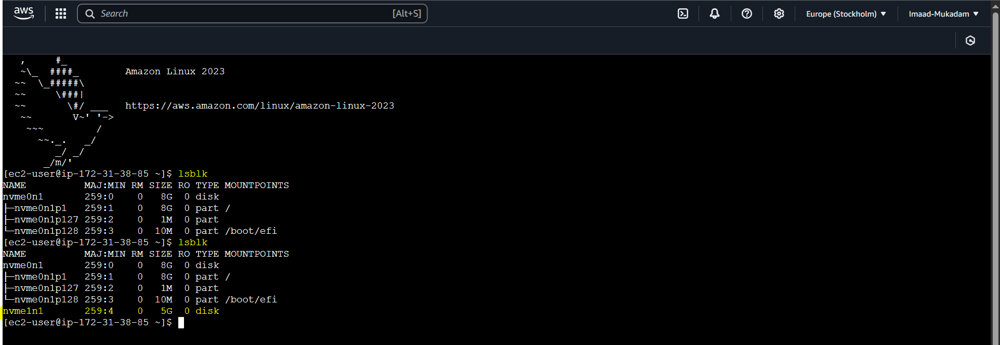


You can see the new volume is attached successfully.
